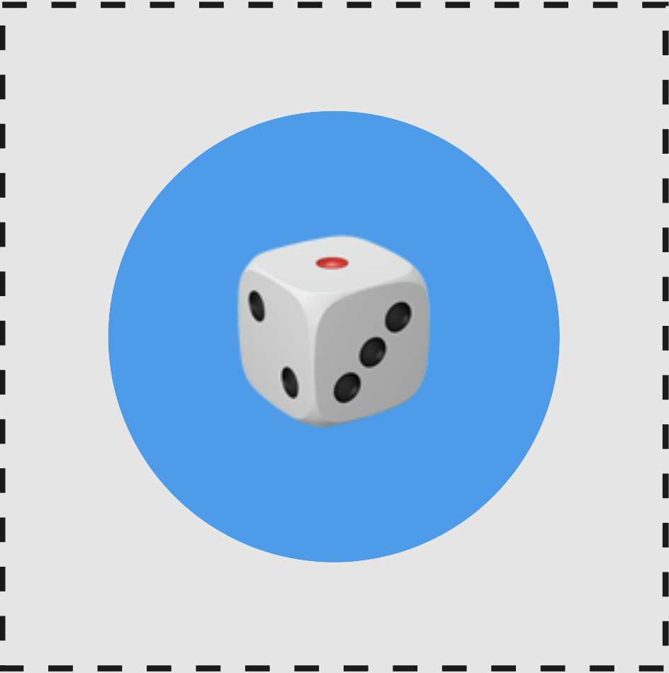
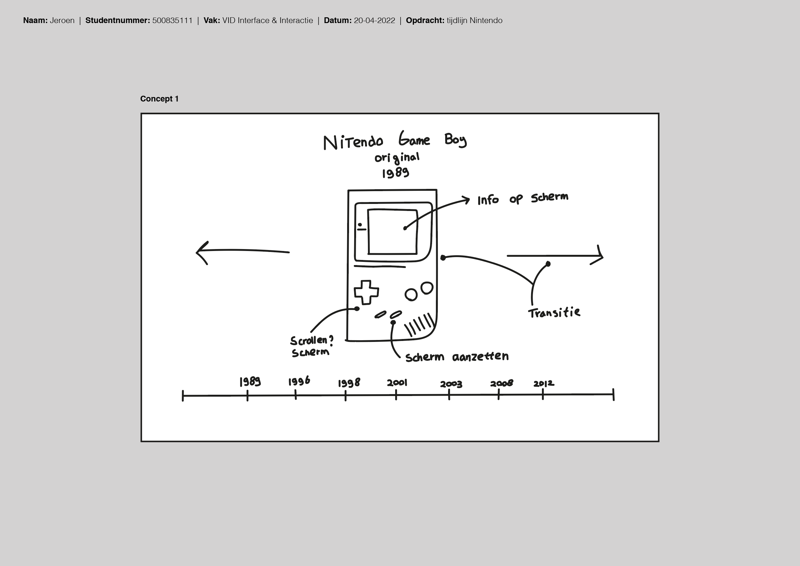
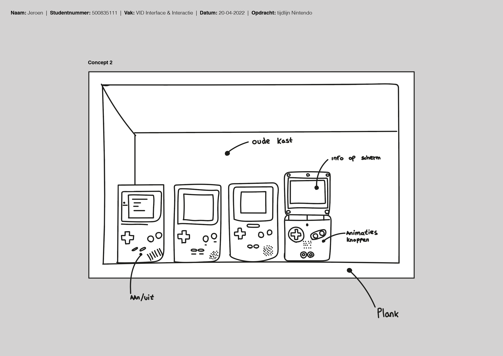

# Procesverslag
Markdown is een simpele manier om HTML te schrijven.  
Markdown cheat cheet: [Hulp bij het schrijven van Markdown](https://github.com/adam-p/markdown-here/wiki/Markdown-Cheatsheet).

Nb. De standaardstructuur en de spartaanse opmaak van de README.md zijn helemaal prima. Het gaat om de inhoud van je procesverslag. Besteedt de tijd voor pracht en praal aan je website.

Nb. Door *open* toe te voegen aan een *details* element kun je deze standaard open zetten. Fijn om dat steeds voor de relevante stuk(ken) te doen.

## Jij

### Ontwerper:
Jeroen

#### Je startniveau:
Mijn startniveau is: blauw, omdat het toch alweer een tijdje geleden is dat ik heb gewerkt met code.
De laatste keer was vorig jaar bij het vak "Frontend voor Designers".

# Je plan

  
De eerste versie/schets van je ontwerp & je persoonlijke uitdaging

  ## De eerste versie/schets:
  
  ### Concept 1
  
  
  De gebruiker kan op de tijdlijn aangeven over welke Game Boy hij/zij informatie wil. De informatie zal te zien zijn op het schermpje waneer de gebruiker op de aan/uit knop heeft gedrukt. Ben wel 'bang' dat ik bij dit concept teveel JavaScript moet gebruiken.
  
  ### Concept 2
  
  
  Interface bestaat uit een plank van een boekenkast waar Game Boys 'tentoongesteld' worden - een soort van verzameling van iemand. Het verwerven van informatie werkt op dezelfde manier als bij concept 1.
  
  ### Concept 3
  
  
  Dit idee ontstond doordat ik toevallig vandaag een oude la open deed en mijn oude controllers van verschillende PlayStation generaties zag liggen. De oudste controllers lagen achterin de la - de nieuwste (wel kapot) lagen voorin.
  Een unieke tijdlijn eigenlijk. Ik wil ook dat de gebruiker de la open en dicht kan doen (met misschien iets van een 'paasei'. Informatie over de Game Boy werkt hetzelfde als bij concept 1.
    
    

  ### Je ambitie: 
  Aan deze technieken/punten wil ik werken:
  - Nette code 
  - Game Boy maken met HTML & CSS
  - Animaties 
  - Knoppen van de Game Boy werken (met JavaScript)
 

## Voortgang/Feedback 1

  
Mijn bevindingen + wijzigingen (minimaal 5)

  ### Bevinding 1:
 Goed kijken waar de aan/uit knop zit - dit is bij elke Game Boy anders. Soms zit het aan de bovenkant, waardoor ik even goed moet kijken hoe ik dit werkend wil krijgen (animatie en interactie).

  #### oplossing:
Ik heb hier nog geen oplossing voor. Ik zou eventueel de gebruiker op een andere knop kunnen laten klikken, maar dit is wel minder realistisch. 

  ### Bevinding 2:
  Ik had nog niet nagedacht over easter eggs.

  #### oplossing:
Tijdens het feedbackgesprek kreeg ik idee over een mogelijke easter egg. Wanneer de gebruiker de la dicht doet, kan ik ervoor zorgen dat iets te zien is op de grond (onder de la). 

  ### Bevinding 3:
Mijn plan was om alles te maken met code - ook alle verschillende Game Boys. Ik kreeg tijdens het feedbackgesprek te horen dat het misschien beter is om niet alles met CSS te maken in verband met de korte tijd die we hebben.

  #### oplossing:
Wanneer ik merk dat ik te weinig tijd heb, kan ik ervoor kiezen om bijvoorbeeld een paar Game Boys in CSS te maken en de rest in Adobe Illustrator (het scherm en de buttons wel met CSS, zodat ik wel animaties en interacties kan toevoegen).

  ### Bevinding 4:
De la met de verschillende generaties Game Boys dient als tijdlijn. Als feedback kreeg ik te horen dat ik de tijdlijn kan uitbreiden door games op het scherm af te spelen. Hierdoor ziet de gebruiker ook direct het verschil in games (en niet alleen het design van de Game Boy zelf).

  #### oplossing:
Wanneer de gebruiker op een bepaalde knop drukt zal er een video afspelen met een game uit de tijd van de desbetreffende Game Boy. Info over de Game Boy zal ook 'gewoon nog' te zien zijn wanneer de gebruiker op een andere knop klikt.  

## Voortgang/Feedback 2

  
Mijn bevindingen + wijzigingen (minimaal 5)

  
  ### Bevinding 1:
  Omschrijving van wat er nog niet orde was (tekst en afbeeding(en)).

  #### oplossing:
  Beschrijving hoe je het hebt hebt opgelost of als het niet gelukt is hoe je het zou oplossen (tekst en afbeeding(en)).

  ### Bevinding 2:
  Omschrijving van wat er nog niet orde was (tekst en afbeeding(en)).

  #### oplossing:
  Beschrijving hoe je het hebt hebt opgelost of als het niet gelukt is hoe je het zou oplossen (tekst en afbeeding(en)).

  ### Bevinding 3:
  ...

## Voortgang/Feedback 3

  
Mijn bevindingen + wijzigingen (minimaal 5)

  
  ### Bevinding 1:
  Omschrijving van wat er nog niet orde was (tekst en afbeeding(en)).

  #### oplossing:
  Beschrijving hoe je het hebt hebt opgelost of als het niet gelukt is hoe je het zou oplossen (tekst en afbeeding(en)).

  ### Bevinding 2:
  Omschrijving van wat er nog niet orde was (tekst en afbeeding(en)).

  #### oplossing:
  Beschrijving hoe je het hebt hebt opgelost of als het niet gelukt is hoe je het zou oplossen (tekst en afbeeding(en)).

  ### Bevinding 3:
  ...

## Reflectie

  
Mijn eindresultaat & persoonlijke ontwikkeling

  ### Je uitkomst - karakteristiek screenshot(s):
  

  ### Dit ging goed/Heb ik geleerd: 
  Korte omschrijving met plaatje(s)

  

  ### Dit was lastig/Is niet gelukt:
  Korte omschrijving met plaatje(s)

  

## Bronnenlijst

continu bijhouden terwijl je werkt

Nb. Wees specifiek ('css-tricks' als bron is bijv. niet specifiek genoeg).

1. Game Boy game afbeelding: https://www.polygon.com/features/2019/4/19/18412987/game-boy-best-games-nintendo-pokemon-tetris
2.Vormen maken: https://bennettfeely.com/clippy/
3. ...

