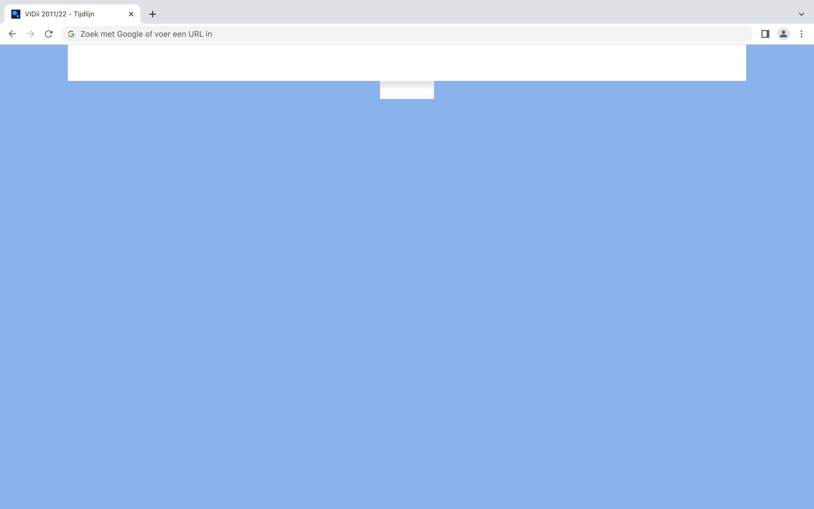
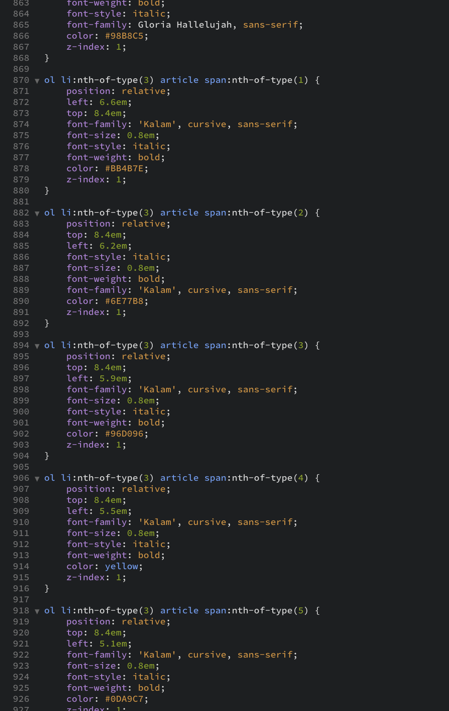
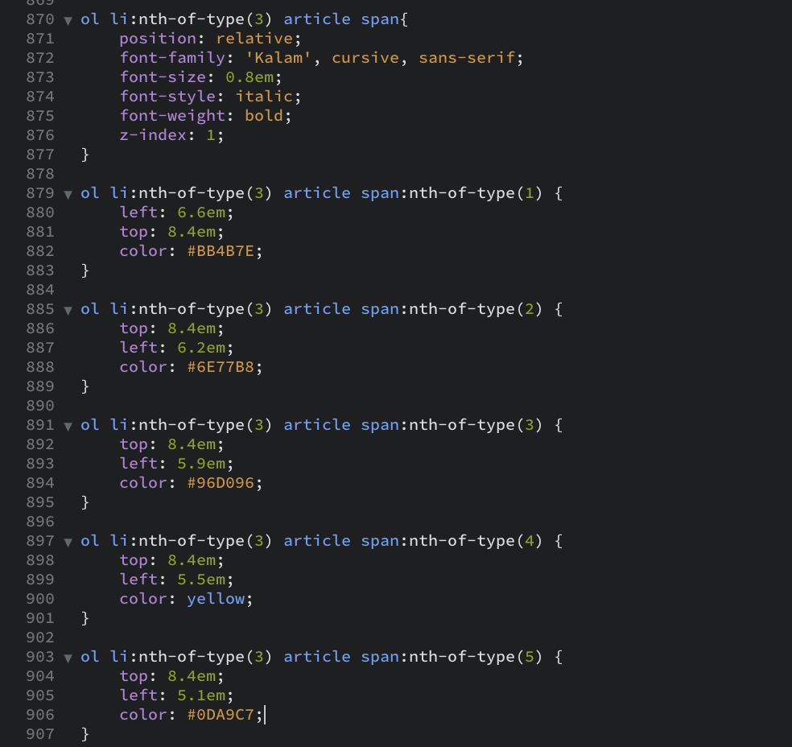

# Procesverslag
Markdown is een simpele manier om HTML te schrijven.  
Markdown cheat cheet: [Hulp bij het schrijven van Markdown](https://github.com/adam-p/markdown-here/wiki/Markdown-Cheatsheet).

Nb. De standaardstructuur en de spartaanse opmaak van de README.md zijn helemaal prima. Het gaat om de inhoud van je procesverslag. Besteedt de tijd voor pracht en praal aan je website.

Nb. Door *open* toe te voegen aan een *details* element kun je deze standaard open zetten. Fijn om dat steeds voor de relevante stuk(ken) te doen.

## Jij

### Ontwerper:
Jeroen

#### Je startniveau:
Mijn startniveau is: blauw, omdat het toch alweer een tijdje geleden is dat ik heb gewerkt met code.
De laatste keer was vorig jaar bij het vak "Frontend voor Designers".

# Je plan

  
De eerste versie/schets van je ontwerp & je persoonlijke uitdaging

  ## De eerste versie/schets:
  
  ### Concept 1
  
  
  De gebruiker kan op de tijdlijn aangeven over welke Game Boy hij/zij informatie wil. De informatie zal te zien zijn op het schermpje waneer de gebruiker op de aan/uit knop heeft gedrukt. Ben wel 'bang' dat ik bij dit concept teveel JavaScript moet gebruiken.
  
  ### Concept 2
  
  
  Interface bestaat uit een plank van een boekenkast waar Game Boys 'tentoongesteld' worden - een soort van verzameling van iemand. Het verwerven van informatie werkt op dezelfde manier als bij concept 1.
  
  ### Concept 3
  
  
  Dit idee ontstond doordat ik toevallig vandaag een oude la open deed en mijn oude controllers van verschillende PlayStation generaties zag liggen. De oudste controllers lagen achterin de la - de nieuwste (wel kapot) lagen voorin.
  Een unieke tijdlijn eigenlijk. Ik wil ook dat de gebruiker de la open en dicht kan doen (met misschien iets van een 'paasei'. Informatie over de Game Boy werkt hetzelfde als bij concept 1.
    
    

  ### Je ambitie: 
  Aan deze technieken/punten wil ik werken:
  - Nette code 
  - Game Boy/vormen maken met HTML & CSS
  - Animaties 
  - Knoppen van de Game Boy werken (met JavaScript)
  - Geluid kunnen toevoegen 
 

## Voortgang/Feedback 1

  
Mijn bevindingen + wijzigingen (minimaal 5)

  ### Bevinding 1:
 Goed kijken waar de aan/uit knop zit - dit is bij elke Game Boy anders. Soms zit het aan de bovenkant, waardoor ik even goed moet kijken hoe ik dit werkend wil krijgen (animatie en interactie).

  #### oplossing:
Ik heb hier nog geen oplossing voor. Ik zou eventueel de gebruiker op een andere knop kunnen laten klikken, maar dit is wel minder realistisch. Update: ik heb ervoor gekozen om de gebruiker te laten drukken op de "START" knop, deze is bij elke Game Boy aanwezig. 

  ### Bevinding 2:
  Ik had nog niet nagedacht over easter eggs.

  #### oplossing:
Tijdens het feedbackgesprek kreeg ik idee over een mogelijke easter egg. Wanneer de gebruiker de la dicht doet, kan ik ervoor zorgen dat iets te zien is op de grond (onder de la). Bijvoorbeeld kleding of rommel. 

  ### Bevinding 3:
Mijn plan was om alles te maken met code - ook alle verschillende Game Boys. Ik kreeg tijdens het feedbackgesprek te horen dat het misschien beter is om niet alles met CSS te maken in verband met de korte tijd die we hebben. 

  #### oplossing:
Wanneer ik merk dat ik te weinig tijd heb, kan ik ervoor kiezen om bijvoorbeeld een paar Game Boys in CSS te maken en de rest in Adobe Illustrator (het scherm en de buttons wel met CSS, zodat ik wel animaties en interacties kan toevoegen).

  ### Bevinding 4:
De la met de verschillende generaties Game Boys dient als tijdlijn. Als feedback kreeg ik te horen dat ik de tijdlijn kan uitbreiden door games op het scherm af te spelen. Hierdoor ziet de gebruiker ook direct het verschil in games (en niet alleen het design van de Game Boy zelf).

  #### oplossing:
Wanneer de gebruiker op een bepaalde knop drukt zal er een video afspelen met een game uit de tijd van de desbetreffende Game Boy. Info over de Game Boy zal ook 'gewoon nog' te zien zijn wanneer de gebruiker op een andere knop klikt.  

## Voortgang/Feedback 2

  
Mijn bevindingen + wijzigingen (minimaal 5)

  
  ### Bevinding 1:
  State focus is nog basic.

  #### oplossing:
  Ik zal deze later veranderen. 

  ### Bevinding 2:
  Commentaar is (nog) niet aanwezig in de code. 

  #### oplossing:
  Ik ga commentaar toevoegen, zodat duidelijk wordt wat wat precies is.
  Zonder commentaar is het onduidelijk, omdat ik bijna geen gebruik maak van class en id (die kan je een betekenisvolle naam geven). 
  
  
  
  ### Bevinding 3:
  CSS properties staan niet in dezelfde volgorde. Het is random. 

  #### oplossing:
  Ik ga binnenkort mijn code 'opruimen' en dan de properties in dezelfde volgorde zetten.
  
  
  
  ### Bevinding 4:
  De CSS code is lang - dat kan korter. 

  #### oplossing:
  Ik zal kijken waar ik code 'dubbel' heb geschreven en zal dit vervolgens weg halen. 
  
  
  
  ### Bevinding 5:
  Afbeeldingen bevatten geen alt. 

  #### oplossing:
  Ik heb alle afbeeldingen een alt gegeven. 
  

  
  
  

## Voortgang/Feedback 3

  
Mijn bevindingen + wijzigingen (minimaal 5)

  
  ### Bevinding 1:
Met CSS gemaakte voorwerpen staan los in de main, dit is geen nette code. 

  #### oplossing:
Ik heb de voorwerpen in een ol > li gezet. Dit is netter en bovendien moest dit ook om mijn la interactief te maken.  

  ### Bevinding 2:
D-pad is gemaakt met div, het is beter dit te maken met een button (of vier verschillende buttons). 

  #### oplossing:
  Ik heb geprobeerd de D-pad te maken met buttons - ik vond dit wel erg lastig. Uiteindelijk is dit volgens mij redelijk gelukt, alleen had ik problemen met het toevoegen ervan in de article. De code ging dan 'stuk'. Door te weinig tijd heb ik dit helaas niet kunnen 'repareren' en heb ik de oude div weer erbij gehaald. De nieuwe D-pad staat wel in de code (HTML & CSS), maar staat in het 'grijs'. 

  ### Bevinding 3:
 Voor Google en screenreaders is het beter om een h1 in een article als eerste op te nemen. 

  #### oplossing:
Ik heb dit verwerkt in de eerste article van de Game Boy 1989. Bij de GameBoy Pocket, Color en Advance SP heb ik dit ook geprobeerd, maar werkte vervolgens mijn CSS er niet meer van... Ik denk dat het iets te maken heeft met "nth-of-type" dat makkelijk te repareren is, alleen heb ik het door te weinig nog niet kunnen vinden. Vandaar dat deze feedback alleen bij de de Game Boy 1989 is verwerkt.  

  ### Bevinding 4:
Div bij regel 154 en 155 van HTML kunnen beter vervangen worden door iets wat netter is. 

  #### oplossing:
Ik weet dat deze div niet netjes is. Deze div heb ik gebruikt om een  '3D schaduw' te maken. Ik had eerst geprobeerd een section te stijlen, maar dit lukte niet. Ik denk dat dit wederom te maken heeft met een "nth-of-type" foutje. Voor nu heb ik even gebruik gemaakt van 'plakband' (door een div te gebruiken), maar het is de bedoeling dat als ik tijd over heb dit op een betere manier ga realiseren. 

  ### Bevinding 5:
Animatie van de la ontbreekt. 

  #### oplossing:
Ik heb een animatie gemaakt wanneer de gebruiker de la open doet. De la is ook te bedienen met de pijltjes toetsen (pijltje naar boven en beneden).

  ### Bevinding 6:
id "dpad" wordt vaker dan 1 keer gebruikt in de HTML. 

  #### oplossing:
Ik ben me hiervan bewust en dit lijkt ook echt als een beginnersfout. Ik heb geprobeerd dit te veranderen in een class, maar vreemd genoeg werkt dit niet in CSS (maar een id wel...). Er zal vast ergens een foutje in mijn code zitten, maar ik ben er nog niet achtergekomen waar precies. Als ik tijd over heb zal ik dit proberen op te lossen.   

## Reflectie

  
Mijn eindresultaat & persoonlijke ontwikkeling

  ### Je uitkomst - karakteristiek screenshot(s):
  
  
  
  
  
  
  

  ### Dit ging goed/Heb ik geleerd: 
  Ik vond het een leuk vak en ook een hele leuke opdracht. Ik had vorig jaar het vak Frontend voor Designers gevolgd, dus ik wist wel al wat van CSS af. Echter was het wel al weer bijna een jaar geleden, dus ik moest wel weer echt even inkomen. Ik ben uiteindelijk blij met het visuele eindresultaat. Ik heb gekozen om alles te maken met CSS - het kostte me erg veel tijd, maar het geeft me uiteindelijk wel een veel beter gevoel. Illustraties maken in Illustrator voelt voor mij toch een beetje als 'valsspelen' bij dit vak. Doordat ik alles met CSS heb gemaakt heb ik ook weer meer geleerd over het maken van voorwerpen/vormen. Ook heb ik geleerd hoe ik geluid met HTMl & JavaScript kan schrijven. Dit wist ik tot heden niet, maar wilde ik wel altijd al graag leren. Ook is het gelukt om met JavaScript de buttons werkend te krijgen.  
  

  ### Dit was lastig/Is niet gelukt:
  In het begin vond ik het lastig om de la te maken. Ik wist niet meer zo goed hoe ik dit het beste kon doen. Docent Sanne had een beginnetje voor me gemaakt. Dit hielp me goed op weg. Ik ben begonnen om de voorwerpen met CSS te maken. Nadat ik ze allemaal had gemaakt moesten ze in een ol en li. Dit kreeg ik niet voor elkaar zonder dat mijn website 'heel' bleef. Ik heb hierover een vraag gesteld en met het antwoord van Sanne kwam ik weer verder. Het heeft me wel erg veel tijd gekost, doordat de "nth-of-type" niet meer juist was. Soms was ik uren bezig om te vinden waarom sommige voorwerpen geen vormgeving meer hadden. Uiteindelijk het probleem gevonden en is het achteraf heel logisch... Verder kwam ik wel in tijdnood waardoor ik niet alle foutjes/verbeteringen heb kunnen vinden/repareren/uitvoeren (van de feedback - vermeld in dit verslag). Zoals het vormgeven van de focus state, korter maken van de hele code (dubbel geschreven regels CSS weghalen), D-pad veranderen in een button, elke h1 bovenaan de article zetten, de dpad id naar class veranderen en een div van de 3D schaduw te veranderen naar een section.  
  Oh en ik wilde ook nog een Nintendo switch maken die ergens zou liggen op de grond (onder de la), maar door te weinig tijd ben ik hier niet aan toe gekomen. 
  
  Ik heb wel een deel van mijn code korter kunnen maken (niet alles want ik kwam in tijdnood). Hieronder is een before and after te zien. 
  
  
  
  
  

## Bronnenlijst

continu bijhouden terwijl je werkt

Nb. Wees specifiek ('css-tricks' als bron is bijv. niet specifiek genoeg).

1. Game Boy games afbeelding: https://www.polygon.com/features/2019/4/19/18412987/game-boy-best-games-nintendo-pokemon-tetris
2. Vormen maken: https://bennettfeely.com/clippy/
3. Game op scherm Game Boy 1989: https://en.wikipedia.org/wiki/Tetris_(Game_Boy_video_game)#/media/File:GB_Tetris.png
4. Game op scherm Game Boy Pocket: https://dribbble.com/shots/1445031-Gameboy-Pocket
5. Game op Game Boy Color: https://www.nintendo.nl/Games/Game-Boy-Color/Super-Mario-Bros-Deluxe-266219.html
6. Game op scherm Game Boy Advance SP: https://www.retronintendokopen.nl/gameboy
7. Game op scherm Nintendo DS: https://www.juegoviejo.com/portable/nintendo-ds-new-super-mario-bros/
8. Game op scherm Game Boy Micro: https://www.retronintendokopen.nl/gameboy
9. Kleurtjes: https://mycolor.space/gradient
10. ol witruimte weghalen: https://stackoverflow.com/questions/27618000/why-ul-adds-extra-top-margin
11. Transitie: https://easings.net
12. Animatie laten stoppen bij laatste frame: https://stackoverflow.com/questions/4359627/stopping-a-css3-animation-on-last-frame
13. JavaScript keycode: https://keycode.info/for/arrow-up
14. Schaduw randen van Game Boy oefening: https://codepen.io/shooft/pen/zYpezwG?editors=1100
15. Muziekje Game Boy 1989: https://freesound.org/people/milton./sounds/105251/?page=1#comment
16. Lettertype Roboto: https://fonts.google.com/specimen/Roboto?query=roboto
17. Lettertype Fuzzy Bubbles: https://fonts.google.com/specimen/Fuzzy+Bubbles?query=fuzzy
18. Lettertype Patrick Hand: https://fonts.google.com/specimen/Patrick+Hand?query=patrick

